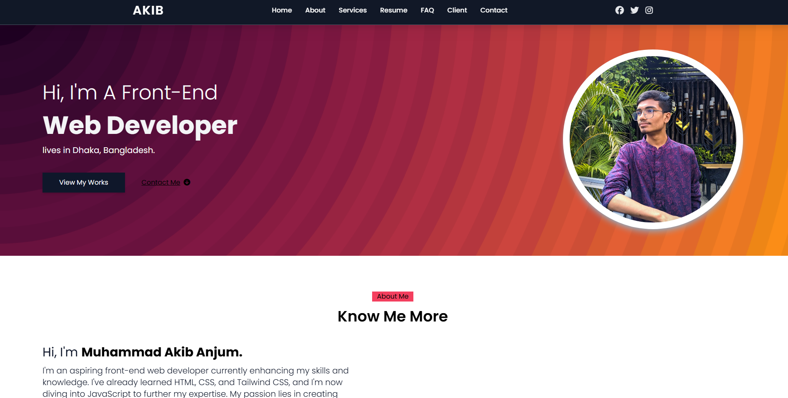

# 💼 Developer Portfolio Website

This is my personal **developer portfolio website**, originally built as a practice project and now used professionally to showcase my skills, experience, and projects. It's designed with responsiveness, performance, and a clean UI in mind.

## 🚀 Features

- 🧠 About Me section with skills and tech stack
- 📁 Projects showcase with links and details
- 📞 Contact form with email integration
- 📱 Fully responsive design
- 🌐 Deployed online and optimized for performance

## 🛠️ Tech Stack

- **Frontend:** HTML, CSS, Tailwind CSS, JavaScript, React.js
- **Backend (optional if dynamic):** Node.js, Express.js
- **Auth & Deployment (if used):** Firebase, Vercel/Netlify
- **Other Tools:** Git, GitHub

## 📸 Preview

 <!-- Add a real screenshot file or link -->

## 📦 Installation (if needed locally)

```bash
git clone https://github.com/your-username/portfolio-website.git
cd portfolio-website
npm install
npm start
